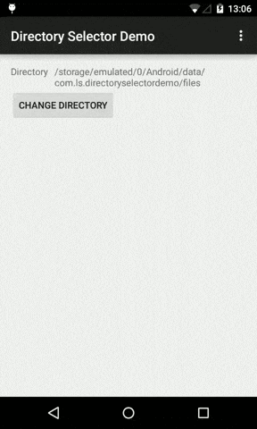

# Description
The project contains an Android library which provides directory selection functionality using **DialogFragment** and **DialogPreference** and a Demo application.

## How to use
Import the library into your project and use it in the following ways:
### Using **DialogFragment**
1. Implement **DirectoryDialog.Listener** interface in your activity:
 
 ```java
public class MainActivity extends Activity implements DirectoryDialog.Listener {

	  @Override
	  public void onDirectorySelected(File dir) {
	  }

	  @Override
	  public void onCancelled() {
	  }

	  // ...
}
```
2. Open directory selector dialog when needed:
 
 ```java
DialogFragment dialog = DirectoryDialog.newInstance(settings.getStorePath());
dialog.show(getFragmentManager(), "directoryDialog");
```

### Using **DialogPreference**
1. Define directory preference entry in your preferences file:
 
 ```xml
<?xml version="1.0" encoding="utf-8"?>
<PreferenceScreen xmlns:android="http://schemas.android.com/apk/res/android">
    <com.ls.directoryselector.DirectoryPreference
            android:key="store_path"
            android:title="@string/dir_location"
            android:summary="Path"
            android:positiveButtonText="@android:string/ok"
            android:negativeButtonText="@android:string/cancel" />
</PreferenceScreen>
```
2. Implement your custom **PreferenceActivity** activity which will use our preference file and open it when needed (most likely on menu item click). Refer to **SettingsActivity** in Demo application for example. Note how the preference "summary" is updating there.
3. Clicking on **DirectoryPreference** entry will open a directory selection dialog. Selecting a directory will automatically save it in shared preferences using configured key.

## License
The project is available under MIT license. See the file **license** with the full license text.

## Compatibility
Minimum SDK version is 14.
